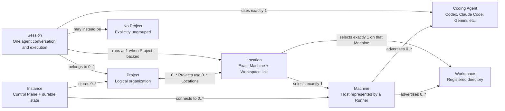

# Concepts and Glossary

Wollipog coordinates coding agents across one or more development machines. The shortest useful
mental model is:

> An Instance connects to Machines. Machines expose Coding Agents and Workspaces. Projects organize
> Sessions and use Locations to say where those Sessions can run.

## Relationship Diagram

The diagram describes product relationships, not process placement. The browser or desktop UI may
run on a different machine from both the Control Plane and the coding agent.

## Glossary

### Instance

A configured deployment of the Wollipog **Control Plane**, including its durable database identity
and API endpoint. An Instance owns its Projects, Location links, Session history, credentials,
automations, and other control-plane state.

- The desktop app normally starts a local Instance on the same computer.
- The UI can also connect to saved remote Instances.
- More than one Instance can run on one physical computer; “Instance” identifies control-plane
  state, not the hardware by itself.

### Control Plane

The service at the center of an Instance. It stores durable state, exposes the HTTP and WebSocket
API used by the UI, coordinates connected Runners, and routes commands and live events. It does not
run coding-agent tools against repositories itself.

### Machine

A user-facing development host represented in Wollipog by a connected **Runner**. The Machine owns
the repository, filesystem, toolchain, credentials, and installed coding-agent CLIs.

Each Machine has a user-owned name used in selectors and Location labels. Its hostname and
connection identifier remain visible as diagnostic metadata, but they are not the Machine's
display identity. Machine settings can rename the Machine, register additional Workspaces, and
delete the connection.

“Machine” is a product concept, not physical-host deduplication: two separately configured Runners
could technically report the same hostname and still be distinct connections.

### Runner

The lightweight service installed or started on a Machine. It connects outbound to one Instance,
advertises that Machine's Workspaces and Coding Agents, starts Sessions, and streams normalized
events back to the Control Plane.

### Coding Agent

An agent target advertised by a Runner, such as Codex, Claude Code, Gemini, or an ACP-compatible
agent. A Coding Agent includes the driver and execution context needed to launch it on that Machine.
A Session selects one exact Coding Agent.

### Workspace

A directory registered or advertised by one Runner as a place where work can run. A Workspace has
an identity, display name, and root path on its Machine.

- A directory does not become a Workspace merely because it exists on disk; it must be advertised
  by the Runner or registered through Wollipog.
- The same-looking path on two Machines represents two different Workspaces.
- A Workspace is infrastructure. It does not organize Sessions by itself.

### Location

One exact `(Machine, Workspace)` pair where work can run. Projects link to Locations through
stable, Project-specific membership records.

A Location answers:

> Where can this Project run?

Important consequences:

- A Location can be used by more than one Project.
- Adding or removing a Location changes only that Project's membership. It does not move or rename
  anything on disk and does not affect other Projects using the same Location.
- A Location remains configured when its Machine is offline or its Workspace is temporarily
  missing. In that state it exists, but it is not **available** for a new Session.
- Display names and paths are descriptive, not identity. Equal names never merge Locations.

### Session

One coding-agent conversation and execution history. A Session selects a Machine, execution path,
and Coding Agent.

- A Project-backed Session belongs to one Project and runs at one exact Location.
- A Session may instead be explicitly assigned to **No Project**.
- Forks and worktrees inherit the source Project and Location.
- Historical Session metadata remains meaningful even if its Location later becomes unavailable or
  is removed from future launches.

### Project

A durable, user-visible way to organize related Sessions. A Project has its own stable identity,
name, visibility, access scope, and zero or more Locations.

A Project does **not** have to contain a Location at all times. Empty Projects are valid so they can
be created before infrastructure is ready, survive Location removal, and remain visible after
Sessions are archived. A Project needs at least one **available** Location before a new
Project-backed Session can start.

### Worktree

A temporary Git working tree used to isolate a Session's branch from the Workspace root. A worktree
is an execution artifact inside the selected Location; it is not a new Workspace, Location, or
Project.

## Core Rules

1. **Configured is not the same as available.** A Project may show one Location while reporting
   “No Available Locations” because its Machine is offline or its Workspace is missing.
2. **Projects are logical; Locations are physical.** Renaming or deleting a Project never renames or
   deletes repository folders.
3. **Identity is exact.** Wollipog links stable IDs, never matching names or paths heuristically.
4. **A Project may be empty.** It can have zero Locations and zero Sessions.
5. **A runnable Project needs a Location.** Starting a Project-backed Session requires one available
   Location.
6. **Sessions can remain ungrouped.** No Project is an explicit supported state, not an error.
7. **Archiving is independent.** Archiving Sessions leaves their Project and Locations in place.
8. **Locations are reusable.** Several Projects can use the same exact Machine and Workspace.

## Examples

### One Computer, Everything Local

Suppose the desktop app, Control Plane, Runner, Codex, and repository all run on a laptop:

| Concept | Example |
| --- | --- |
| Instance | The local Wollipog Control Plane and its database |
| Machine | `Misko-T14s-G6`, represented by its local Runner |
| Coding Agent | Codex App Server discovered on that Machine |
| Workspace | `C:\Users\developer\Dev\wollipog` |
| Project | `Wollipog` |
| Location | `Misko-T14s-G6` + the `wollipog` Workspace |
| Session | A Codex conversation implementing an Inbox feature |

If the Runner stops, the Project and Location still exist. The Location becomes unavailable until
the Runner reconnects.

### Local Control Plane, Remote Development Machine

The desktop app and Instance run on a laptop, while an SSH-connected Linux workstation owns the
repository:

| Concept | Example |
| --- | --- |
| Instance | The Control Plane on the laptop |
| Machine | `buildbox`, connected through its Runner |
| Workspace | `/home/developer/dev/service-api` on `buildbox` |
| Location | `buildbox` + `/home/developer/dev/service-api` |
| Session | Claude Code running on `buildbox`, viewed from the laptop |

The agent, shell, Git commands, and files stay on `buildbox`; only commands and normalized events
travel through the Instance.

### One Project, Multiple Locations

A `Service API` Project can link:

- a local Windows Workspace for quick edits;
- a Linux workstation Workspace for integration testing; and
- a cloud VM Workspace for a long-running migration.

These are three Locations for one logical Project. Each new Session chooses one exact Location.
The Sessions appear together under `Service API`, even though their files and tools live on
different Machines.

### Worktree Session

A Session starts from the `Wollipog` Project's laptop Location and asks for worktree isolation. The
Runner creates a separate Git worktree and runs the agent there. The Session still belongs to the
same Project and Location; the worktree is not added as another Location.

## Related Documentation

- [Runner Credentials and Local Secrets](./runner-credentials-and-secrets.md)
- [Execution Targets](./execution-targets.md)
